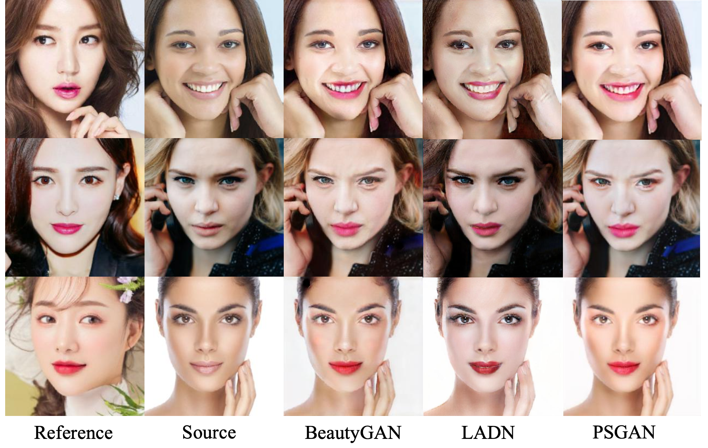
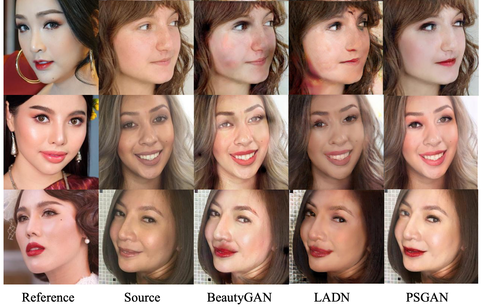
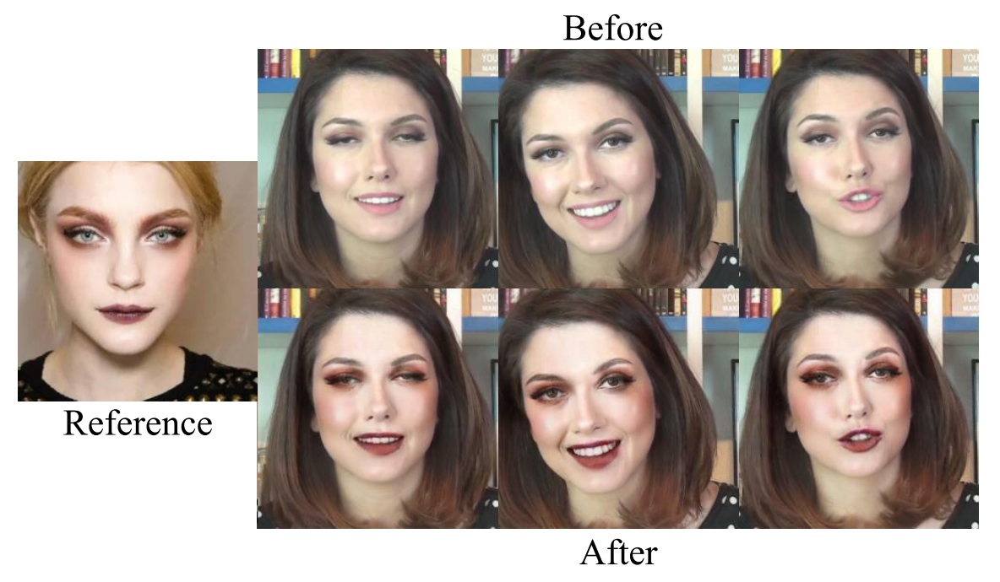

# AI Makeup Transfer Web Application

🎨 **A Modern Web Application for AI-Powered Makeup Transfer**

Transform your photos with beautiful makeup styles using advanced machine learning technology. This application provides an intuitive web interface for applying makeup from reference images to target photos.

## ✨ Features

- **Modern Web Interface**: Clean, responsive design with drag-and-drop functionality
- **AI-Powered Makeup Transfer**: Uses advanced neural networks for realistic makeup application
- **Multiple Reference Options**: Choose from pre-loaded makeup styles or upload custom references
- **Real-time Processing**: Live feedback with progress indicators
- **Automatic Face Detection**: Smart face matching and alignment
- **Professional Results**: High-quality output with natural-looking makeup application

## 🚀 Quick Start

### Prerequisites
- Python 3.8+
- Docker (optional)
- Modern web browser

### Installation

1. **Clone the repository**
   ```bash
   git clone https://github.com/HAbuns/non-makeup-app.git
   cd non-makeup-app
   ```

2. **Install dependencies**
   ```bash
   pip install -r requirements.txt
   ```

3. **Run the application**
   ```bash
   python app.py
   ```

4. **Open your browser**
   ```
   http://localhost:5000
   ```

## 🐳 Docker Deployment

### Development
```bash
docker-compose -f docker/docker-compose.yml up --build
```

### Production
```bash
./deployment/deploy.sh production
```

## 📁 Project Structure

```
non-makeup-app/
├── web_app/                # Web application
│   ├── backend/           # Flask backend
│   ├── templates/         # HTML templates
│   └── static/           # CSS, JS, images
├── models/               # AI models and processing
│   ├── psgan/           # Core makeup transfer model
│   ├── faceutils/       # Face detection utilities
│   └── concern/         # Additional processing modules
├── utils/               # Utilities and tools
│   ├── scripts/         # Helper scripts
│   ├── configs/         # Configuration files
│   └── ops/            # Custom operations
├── tests/              # Test suite
├── docker/             # Docker configuration
├── jenkins/            # CI/CD pipeline
└── deployment/         # Deployment scripts
```

## 🛠️ Technology Stack

- **Backend**: Python, Flask
- **Frontend**: HTML5, CSS3, JavaScript
- **AI/ML**: PyTorch, OpenCV, DeepFace
- **Containerization**: Docker, Docker Compose
- **CI/CD**: GitHub Actions, Jenkins
- **Database**: File-based storage

## 🎯 How It Works

1. **Upload Source Image**: Upload a photo you want to apply makeup to
2. **Select Reference Style**: Choose from gallery or upload custom makeup reference
3. **AI Processing**: Advanced neural networks analyze and transfer makeup features
4. **Get Results**: Download your transformed image with applied makeup

## 🔧 Configuration

The application can be configured through:
- `utils/configs/base.yaml` - Main configuration
- Environment variables
- Docker environment settings

## 🧪 Testing

Run the test suite:
```bash
python -m pytest tests/
```

## 🚀 Deployment

### Local Development
```bash
python app.py
```

### Docker
```bash
./deployment/deploy.sh development
```

### Production
```bash
./deployment/deploy.sh production
```

## 📝 API Documentation

### Health Check
```
GET /health
```

### Makeup Transfer
```
POST /transfer
Content-Type: multipart/form-data
- source_image: Image file
- reference_image: Image file (optional)
```

## 🤝 Contributing

1. Fork the repository
2. Create your feature branch (`git checkout -b feature/AmazingFeature`)
3. Commit your changes (`git commit -m 'Add some AmazingFeature'`)
4. Push to the branch (`git push origin feature/AmazingFeature`)
5. Open a Pull Request

## 📄 License

This project is licensed under the MIT License - see the [LICENSE](LICENSE) file for details.

## 🙏 Acknowledgments

- Inspired by PSGAN research in makeup transfer
- Built with modern web technologies
- Designed for ease of use and professional results

## 📧 Contact

**HAbuns** - hunganhk9bt@gmail.com

Project Link: [https://github.com/HAbuns/non-makeup-app](https://github.com/HAbuns/non-makeup-app)

---

⭐ **Star this repo if you found it helpful!**


## Checklist
- [x] more results 
- [ ] video demos
- [ ] partial makeup transfer example
- [ ] interpolated makeup transfer example
- [x] inference on GPU
- [x] training code


## Requirements

The code was tested on Ubuntu 16.04, with Python 3.6 and PyTorch 1.5.

For face parsing and landmark detection, we use dlib for fast implementation.

If you are using gpu for inference, *do* make sure you have gpu support for dlib.


## Test

Run `python3 demo.py` or `python3 demo.py --device cuda` for gpu inference.


## Train
1. Download training data from [link](https://drive.google.com/drive/folders/1ubqJ49ev16NbgJjjTt-Q75mNzvZ7sEEn?usp=sharing), and move it to sub directory named with "data". (For BaiduYun users, you can download the data [here](https://pan.baidu.com/s/1ZF-DN9PvbBteOSfQodWnyw). Password: rtdd)


Your data directory should be looked like:

```
data
├── images
│   ├── makeup
│   └── non-makeup
├── landmarks
│   ├── makeup
│   └── non-makeup
├── makeup.txt
├── non-makeup.txt
├── segs
│   ├── makeup
│   └── non-makeup
```

2. `python3 train.py`

Detailed configurations can be located and modified in configs/base.yaml, where
command-line modification is also supportted.

*Note: * Although multi-GPU training is currently supported, due to the limitation of pytorch data parallel and gpu cost, the numer of
adopted gpus and batch size are supposed to be the same.

## More Results

#### MT-Dataset (frontal face images with neutral expression)




#### MWild-Dataset (images with different poses and expressions)



#### Video Makeup Transfer (by simply applying PSGAN on each frame)



## Citation
Please consider citing this project in your publications if it helps your research. The following is a BibTeX reference. The BibTeX entry requires the url LaTeX package.

~~~
@InProceedings{Jiang_2020_CVPR,
  author = {Jiang, Wentao and Liu, Si and Gao, Chen and Cao, Jie and He, Ran and Feng, Jiashi and Yan, Shuicheng},
  title = {PSGAN: Pose and Expression Robust Spatial-Aware GAN for Customizable Makeup Transfer},
  booktitle = {IEEE/CVF Conference on Computer Vision and Pattern Recognition (CVPR)},
  month = {June},
  year = {2020}
}

@article{liu2021psgan++,
  title={PSGAN++: robust detail-preserving makeup transfer and removal},
  author={Liu, Si and Jiang, Wentao and Gao, Chen and He, Ran and Feng, Jiashi and Li, Bo and Yan, Shuicheng},
  journal={IEEE Transactions on Pattern Analysis and Machine Intelligence},
  volume={44},
  number={11},
  pages={8538--8551},
  year={2021},
  publisher={IEEE}
}
~~~

## Acknowledge
Some of the codes are built upon [face-parsing.PyTorch](https://github.com/zllrunning/face-parsing.PyTorch) and [BeautyGAN](https://github.com/wtjiang98/BeautyGAN_pytorch). 

You are encouraged to submit issues and contribute pull requests.
